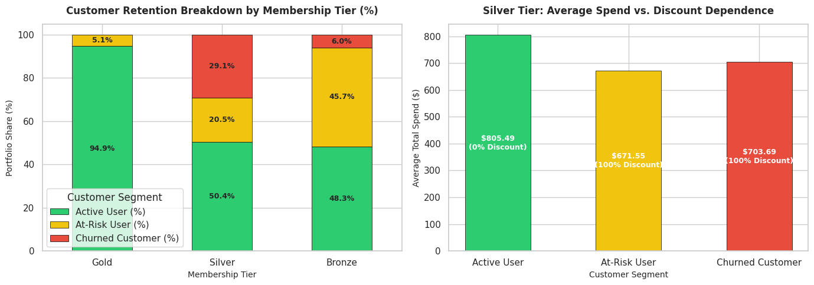

# E-Commerce Customer Behavior & Churn Segmentation Analysis

## Executive Summary
This project analyzes **350 e-commerce customer profiles** to evaluate user retention, recency behavior, and loyalty program performance. By building an SQL-based customer segmentation framework, the analysis revealed that while **Gold Members exhibit a 94.9% retention rate**, the **Silver Membership tier suffers from a severe 29.1% churn rate**, driven by heavy discount reliance among incentive-sensitive users.

---

## Business Problem & Objectives
High Customer Acquisition Cost (CAC) makes user retention critical for sustainable growth. The core objectives of this diagnostic analysis are:
1. Segment the user base into **Active**, **At-Risk**, and **Churned** tiers based on transaction recency (`Days Since Last Purchase`).
2. Evaluate whether loyalty tiers (`Gold`, `Silver`, `Bronze`) effectively mitigate customer churn.
3. Identify behavioral drivers (`Total Spend`, `Average Rating`, `Discount Applied`) behind customer attrition in vulnerable segments.

---

## Executive Dashboard

---

## Key SQL Insights & Diagnostic Findings

### 1. Portfolio Recency & Spend Distribution
* **Active Users (0–30 Days Recency):** Represent **64.57%** of the portfolio (226 users) with the highest average spend at **$969.30**.
* **At-Risk Users (31–45 Days Recency):** Accounts for 83 users with a **38.5% drop in average spend** ($595.26), indicating a sharp decline in engagement.
* **Churned Users (>45 Days Recency):** 41 customers have lapsed, averaging **$668.64** in historical spend.

### 2. Loyalty Tier Performance
* **Gold Tier (High Retention):** **94.9% of Gold members remain Active** (111 of 117 users) with 0% churn and an average spend of **$1,319.82**.
* **Silver Tier (Leakage Point):** Accounts for **82.9% of all churned users across the platform** (34 out of 41 total churners), representing a 29.1% tier churn rate.
* **Bronze Tier (Activation Opportunity):** 45.7% of Bronze members are sitting in the **At-Risk** zone, requiring re-engagement campaigns.

### 3. Silver Tier Root Cause Analysis
A deep dive into Silver Tier members revealed a distinct behavioral split:
* **Active Silver Members:** Average spend of **$805.49**, high satisfaction (**4.17 rating**), and **0% discount rate**. They are organic, value-driven buyers.
* **Churned Silver Members:** **100% received discounts**, accompanied by lower satisfaction (**4.02 rating**). Promo-driven acquisitions fail to sustain retention once price incentives end.

---

## Actionable Business Recommendations

| Customer Segment | Identified Driver | Recommended Strategy |
| :--- | :--- | :--- |
| **Active Silver Members** | High satisfaction, 0% discount dependence. | Deploy milestone-based upgrade incentives (e.g., "Complete 2 more purchases to reach Gold status"). |
| **At-Risk / Churned Silver** | 100% discount dependence, lower ratings. | Shift from generic price cuts to personalized, product-focused re-engagement campaigns. |
| **Bronze At-Risk Pool** | 45.7% inactive for 31–45 days. | Trigger automated push notifications within 30 days of last purchase before lapse occurs. |

---

## Tech Stack
* **Database Engine:** SQLite (Google Colab Environment)
* **SQL Techniques:** Common Table Expressions (CTEs), Conditional Aggregations (`CASE WHEN`), Cross-Tabulation, Window Filters
* **Visualization:** Python (Matplotlib & Seaborn)
